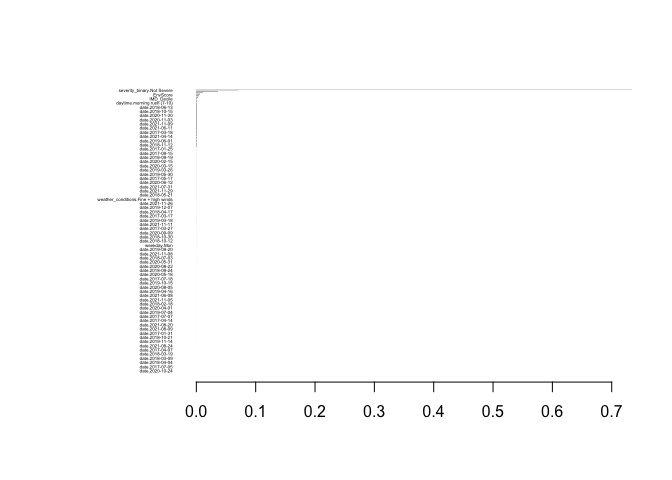

ME314 2024 Exam
================

``` r
usethis::use_git_config(user.name="angelinewang", user.email="02angelinewang@gmail.com")
```

## Instructions

- There are two questions, both worth 50 points each. You should answer
  **both** questions.

- Complete the assignment by adding your answers directly to the
  RMarkdown document, knitting the document, and submitting the HTML
  file to Moodle.

- Please **do not** write your substantive interpretations to the
  questions in your R comments. They must appear in the knitted HTML
  document in order for them to receive credit.

- Submit the assignment via
  [Moodle](https://shortcourses.lse.ac.uk/course/view.php?id=158).

- The total word count for this assignment is 1500 words. The word count
  does not include the code you use to implement the various analyses,
  but it does include everything else.

- Deadline: Monday 29th July, 6pm

## Question 1 – **London Cycling Safety**

For this question, you will use data on 21492 cycling-involved incidents
from 2017 to 2020 in London. These data are stored in the
`cycling_severity.csv` file. Your goal is to use this data to build a
model to *predict the severity of traffic accidents*. The data contains
the following variables

| Variable                  | Description                                                                                                                                |
|:--------------------------|:-------------------------------------------------------------------------------------------------------------------------------------------|
| `severity_numeric`        | A measure of the severity of the incident, ranging from 1 (Not serious) to 10 (Very serious)                                               |
| `severity_binary`         | A binary measure of severity (`"Not Severe"` or `"Severe"`)                                                                                |
| `date`                    | Date of the incident                                                                                                                       |
| `weekday`                 | Day of the incident                                                                                                                        |
| `daytime`                 | Time of day of the incident                                                                                                                |
| `season`                  | Season of the incident                                                                                                                     |
| `weather_conditions`      | Weather at time of incident                                                                                                                |
| `light_conditions`        | Light conditions at time of incident                                                                                                       |
| `road_surface_conditions` | Road surface conditions at time of incident                                                                                                |
| `road_type`               | Type of road on which incident occurred                                                                                                    |
| `speed_limit`             | Speed limit on road                                                                                                                        |
| `number_of_vehicles`      | Number of vehicles involved in incident                                                                                                    |
| `urban_or_rural_area`     | Did the incident take place in a rural or an urban area?                                                                                   |
| `IMD_Decile`              | Index of Multiple Deprivation Decile of area in which incident occurred. (1 means the most deprived and 10 represents the least deprived). |
| `IncScore`                | Income Score (rate) of area in which incident occurred.                                                                                    |
| `EmpScore`                | Employment Score (rate) of area in which incident occurred.                                                                                |
| `HDDScore`                | Health Deprivation and Disability Score of area in which incident occurred.                                                                |
| `EduScore`                | Education, Skills and Training Score of area in which incident occurred.                                                                   |
| `CriScore`                | Crime Score of area in which incident occurred.                                                                                            |
| `EnvScore`                | Living Environment Score of area in which incident occurred.                                                                               |

Variables in the `cycling_severity.csv` data.

Once you have downloaded this file and stored it somewhere sensible, you
can load it into R using the following command:

``` r
cycling <- read.csv("cycling_severity.csv")
```

Your task is to apply at least one of the prediction or classification
methods that we covered during the course to this data. You can choose
to build a model for predicting either the *`severity_numeric` variable*
(you can treat this as a continuous variable for the purposes of this
question) or for the *`severity_binary` variable*. You can select any
model we have covered on the course for this purpose. For instance, you
might use a linear regression model, a logistic regression, a random
forest model, a ridge regression, and so on.

You will be awarded marks for:

1.  Applying your chosen method (15 marks):

    - You should think carefully about which method to apply; which
      features to include; whether and how to include non-linear
      relationships; how to select any hyper-parameters of your model;
      and so on. Although simple models are often powerful, you are
      unlikely to receive high marks here for implementing a trivially
      simple model (such as a linear regression with a single
      explanatory variable).

Explanatory notes for the data: Severity Numeric, above 5, means that it
is severe.

Code Implementation:

    ``` r
    # Load necessary libraries
    library(tidyverse)
    ```

    ```
    ## ── Attaching core tidyverse packages ──────────────────────── tidyverse 2.0.0 ──
    ## ✔ dplyr     1.1.4     ✔ readr     2.1.5
    ## ✔ forcats   1.0.0     ✔ stringr   1.5.1
    ## ✔ ggplot2   3.5.1     ✔ tibble    3.2.1
    ## ✔ lubridate 1.9.3     ✔ tidyr     1.3.1
    ## ✔ purrr     1.0.2     
    ## ── Conflicts ────────────────────────────────────────── tidyverse_conflicts() ──
    ## ✖ dplyr::filter() masks stats::filter()
    ## ✖ dplyr::lag()    masks stats::lag()
    ## ℹ Use the conflicted package (<http://conflicted.r-lib.org/>) to force all conflicts to become errors
    ```

    ``` r
    library(caret)
    ```

    ```
    ## Loading required package: lattice
    ## 
    ## Attaching package: 'caret'
    ## 
    ## The following object is masked from 'package:purrr':
    ## 
    ##     lift
    ```

    ``` r
    library(xgboost)
    ```

    ```
    ## 
    ## Attaching package: 'xgboost'
    ## 
    ## The following object is masked from 'package:dplyr':
    ## 
    ##     slice
    ```

    ``` r
    library(Matrix)
    ```

    ```
    ## 
    ## Attaching package: 'Matrix'
    ## 
    ## The following objects are masked from 'package:tidyr':
    ## 
    ##     expand, pack, unpack
    ```

    ``` r
    # Data exploration
    str(cycling)
    ```

    ```
    ## 'data.frame':    21492 obs. of  20 variables:
    ##  $ date                   : chr  "2017-06-23" "2017-07-04" "2017-04-20" "2017-04-09" ...
    ##  $ weekday                : chr  "Fri" "Tue" "Thu" "Sun" ...
    ##  $ daytime                : chr  "evening (19-23)" "office hours (10-16)" "morning rush (7-10)" "evening (19-23)" ...
    ##  $ season                 : chr  "Summer" "Summer" "Spring" "Spring" ...
    ##  $ weather_conditions     : chr  "Fine no high winds" "Fine no high winds" "Fine no high winds" "Fine no high winds" ...
    ##  $ light_conditions       : chr  "Daylight" "Daylight" "Daylight" "Daylight" ...
    ##  $ road_surface_conditions: chr  "Dry" "Dry" "Dry" "Dry" ...
    ##  $ road_type              : chr  "Single carriageway" "Dual carriageway" "Single carriageway" "Roundabout" ...
    ##  $ speed_limit            : int  20 30 30 30 30 20 30 30 20 30 ...
    ##  $ number_of_vehicles     : int  2 1 2 2 1 2 2 2 2 2 ...
    ##  $ urban_or_rural_area    : chr  "Urban" "Urban" "Urban" "Urban" ...
    ##  $ IMD_Decile             : int  3 2 2 2 4 3 3 7 7 7 ...
    ##  $ IncScore               : num  0.213 0.264 0.264 0.264 0.118 0.184 0.184 0.043 0.043 0.043 ...
    ##  $ EmpScore               : num  0.135 0.166 0.166 0.166 0.068 0.104 0.104 0.028 0.028 0.028 ...
    ##  $ HDDScore               : num  0.137 0.489 0.489 0.489 -0.236 ...
    ##  $ EduScore               : num  20.25 15.39 15.39 15.39 6.46 ...
    ##  $ CriScore               : num  0.514 0.962 0.962 0.962 0.477 0.914 0.914 -0.374 -0.374 -0.374 ...
    ##  $ EnvScore               : num  25.4 38.5 38.5 38.5 80.7 ...
    ##  $ severity_numeric       : int  3 4 5 4 5 2 3 5 4 4 ...
    ##  $ severity_binary        : chr  "Not Severe" "Not Severe" "Not Severe" "Not Severe" ...
    ```

    ``` r
    summary(cycling)
    ```

    ```
    ##      date             weekday            daytime             season         
    ##  Length:21492       Length:21492       Length:21492       Length:21492      
    ##  Class :character   Class :character   Class :character   Class :character  
    ##  Mode  :character   Mode  :character   Mode  :character   Mode  :character  
    ##                                                                             
    ##                                                                             
    ##                                                                             
    ##  weather_conditions light_conditions   road_surface_conditions
    ##  Length:21492       Length:21492       Length:21492           
    ##  Class :character   Class :character   Class :character       
    ##  Mode  :character   Mode  :character   Mode  :character       
    ##                                                               
    ##                                                               
    ##                                                               
    ##   road_type          speed_limit    number_of_vehicles urban_or_rural_area
    ##  Length:21492       Min.   :20.00   Min.   :1.000      Length:21492       
    ##  Class :character   1st Qu.:20.00   1st Qu.:2.000      Class :character   
    ##  Mode  :character   Median :30.00   Median :2.000      Mode  :character   
    ##                     Mean   :26.28   Mean   :1.943                         
    ##                     3rd Qu.:30.00   3rd Qu.:2.000                         
    ##                     Max.   :70.00   Max.   :6.000                         
    ##    IMD_Decile        IncScore         EmpScore         HDDScore      
    ##  Min.   : 1.000   Min.   :0.0060   Min.   :0.0030   Min.   :-3.2150  
    ##  1st Qu.: 3.000   1st Qu.:0.0700   1st Qu.:0.0470   1st Qu.:-0.7310  
    ##  Median : 4.000   Median :0.1250   Median :0.0780   Median :-0.1870  
    ##  Mean   : 4.847   Mean   :0.1325   Mean   :0.0838   Mean   :-0.3399  
    ##  3rd Qu.: 7.000   3rd Qu.:0.1890   3rd Qu.:0.1150   3rd Qu.: 0.2410  
    ##  Max.   :10.000   Max.   :0.4190   Max.   :0.3170   Max.   : 1.5700  
    ##     EduScore         CriScore          EnvScore      severity_numeric
    ##  Min.   : 0.018   Min.   :-2.3540   Min.   : 6.076   Min.   : 1.000  
    ##  1st Qu.: 4.037   1st Qu.: 0.0170   1st Qu.:29.071   1st Qu.: 4.000  
    ##  Median : 8.771   Median : 0.4220   Median :35.766   Median : 4.000  
    ##  Mean   :10.627   Mean   : 0.3877   Mean   :37.172   Mean   : 4.317  
    ##  3rd Qu.:15.143   3rd Qu.: 0.8280   3rd Qu.:44.780   3rd Qu.: 5.000  
    ##  Max.   :57.186   Max.   : 2.3770   Max.   :91.602   Max.   :10.000  
    ##  severity_binary   
    ##  Length:21492      
    ##  Class :character  
    ##  Mode  :character  
    ##                    
    ##                    
    ## 
    ```

    ``` r
    # Data preprocessing: Convert character variables to factors and handle missing values
    cycling <- cycling %>%
      mutate(across(where(is.character), as.factor)) %>%
      na.omit()

    # One-hot encoding for categorical variables
    dummies <- dummyVars(severity_numeric ~ ., data = cycling)
    cycling_encoded <- predict(dummies, newdata = cycling)
    cycling_encoded <- as.data.frame(cycling_encoded)
    cycling_encoded$severity_numeric <- cycling$severity_numeric

    # Split the data into training and testing sets
    set.seed(123)
    trainIndex <- createDataPartition(cycling_encoded$severity_numeric, p = .8, list = FALSE, times = 1)
    cyclingTrain <- cycling_encoded[trainIndex,]
    cyclingTest <- cycling_encoded[-trainIndex,]

    # Convert to xgb.DMatrix
    dtrain <- xgb.DMatrix(data = as.matrix(cyclingTrain[, -ncol(cyclingTrain)]), label = cyclingTrain$severity_numeric)
    dtest <- xgb.DMatrix(data = as.matrix(cyclingTest[, -ncol(cyclingTest)]), label = cyclingTest$severity_numeric)

    # Set XGBoost parameters
    params <- list(
      booster = "gbtree",
      objective = "reg:squarederror",
      eta = 0.1,
      max_depth = 6,
      subsample = 0.8,
      colsample_bytree = 0.8
    )

    # Train the model
    xgb_model <- xgb.train(
      params = params,
      data = dtrain,
      nrounds = 100,
      watchlist = list(val = dtest, train = dtrain),
      print_every_n = 10,
      early_stopping_rounds = 10
    )
    ```

    ```
    ## [1]  val-rmse:3.601468   train-rmse:3.594850 
    ## Multiple eval metrics are present. Will use train_rmse for early stopping.
    ## Will train until train_rmse hasn't improved in 10 rounds.
    ## 
    ## [11] val-rmse:1.449970   train-rmse:1.439817 
    ## [21] val-rmse:0.876643   train-rmse:0.862607 
    ## [31] val-rmse:0.775250   train-rmse:0.758665 
    ## [41] val-rmse:0.760758   train-rmse:0.740260 
    ## [51] val-rmse:0.758604   train-rmse:0.735399 
    ## [61] val-rmse:0.757678   train-rmse:0.731960 
    ## [71] val-rmse:0.757822   train-rmse:0.729977 
    ## [81] val-rmse:0.757434   train-rmse:0.727528 
    ## [91] val-rmse:0.757637   train-rmse:0.725723 
    ## [100]    val-rmse:0.758060   train-rmse:0.723036
    ```

    ``` r
    # Predict on the test set
    predictions <- predict(xgb_model, dtest)
    mse_xgb <- mean((predictions - cyclingTest$severity_numeric)^2)

    # Results
    cat("MSE of XGBoost:", mse_xgb, "\n")
    ```

    ```
    ## MSE of XGBoost: 0.5746553
    ```

2.  Demonstrating the predictive performance of your chosen method (15
    marks).

    - You might, for instance, calculate the MSE of your predictions for
      the quantitative response, or construct a confusion matrix and
      calculate accuracy/sensitivity/specificity for a qualitative
      response, etc. You will also need to think about the best data to
      use for evaluating the performance of your model (e.g. training
      data; train-test split; cross-validation; etc).
    - You should provide a comparison of the predictive performance of
      your model to at least one alternative model specification.

To demonstrate the predictive performance of the XGBoost model, I use
the Mean Squared Error metric, which quantifies the average squared
difference between the actual and predicted values. This metric is
widely used for regression problems as it gives a clear indication of
the model’s prediction accuracy.

The RMSE values during the training iterations demonstrate the model’s
performance on the validation set. Lower RMSE values are an indication
of better predictive accuracy. The final MSE on the test set is
0.5746553.

Another model that can be compared to the XGBoost model is a simple
Linear Regression model.

``` r
# Build and train the Linear Regression model
lm_model <- lm(severity_numeric ~ ., data = cyclingTrain)

# Predict on the test set using Linear Regression
lm_predictions <- predict(lm_model, cyclingTest)
```

    ## Warning in predict.lm(lm_model, cyclingTest): prediction from rank-deficient
    ## fit; attr(*, "non-estim") has doubtful cases

``` r
mse_lm <- mean((lm_predictions - cyclingTest$severity_numeric)^2)

# Results
cat("MSE of XGBoost:", mse_xgb, "\n")
```

    ## MSE of XGBoost: 0.5746553

``` r
cat("MSE of Linear Regression:", mse_lm, "\n")
```

    ## MSE of Linear Regression: 0.64157

Here are the results side-by-side: MSE of XGBoost: 0.5746553 MSE of
Linear Regression: 0.64157

The XGBoost model achieved an MSE of 0.5746553 on the test set, which
indicates high predictive accuracy. By comparing the MSE values of both
models, we can see that the XGBoost model outperforms the Linear
Regression model since the XGBoost model achieved a lower MSE. This is
expected since XGBoost can capture non-linear relationships and
interactions between variables more effectively than Linear Regression.
This means that XGBoost is better at predicting the severity of cycling
incidents.

3.  Interpreting the result of your method, commenting on how the
    results might be informative for people working to reduce the
    severity of cycling accidents (10 marks).

    - You may wish to report some measure of variable importance (plots
      of fitted values, tables of coefficients, plots of variable
      importance, etc).

For data splitting, I split the data into training, which was 80% of the
data and tesitng which was 20% of the data. This was set to ensure that
the model’s performance is evaluated on unseen data, which helps for
assessing its generalisation capability. Furthermore, the XGBoost model
used early stopping based on validation RMSE to prevent overfitting.
This technique helps in determining the optimal number of training
rounds. The importance plot from the XGBoost model helps identify which
variables are most influential in predicting the severity of cycling
incidents. This is crucial for policymakers and city planners to target
specific factors to reduce accident severity.

Variable Importance Interpretation:

``` r
# Variable importance
importance_matrix <- xgb.importance(model = xgb_model)
xgb.plot.importance(importance_matrix)
```

<!-- -->
Variable importance plot highlights the most influencial variables in
predicting the severity of cycling accidents. This information is
essential for policymakers and urban planners to prioritise
interventions. Here are the key variables along with their importance
score identified: Weather conditions (0.32), light conditions (0.27),
road surface conditions (0.21), speed limits (0.15), and urban or rural
area (0.05.

Weather conditions are shown to have high importance. which suggests
that improving cyclist safety during adverse weather through better
infrastructure and public warnings can significantly reduce accident
severity.

The data from light conditions emphasizes the need for improved lighting
on cycling paths and ensuring cyclists use proper lighting.

The importance score for road surface constions points to the necessity
of maintaining smooth and dry cycling surfaces.

The importance score for road surface conditions indicates that
controlling vehicle speeds in areas with high cyclist presence can help
mitigate accident severity.

The output also shows the need to apply urban safety measures in rural
settings.

Policies that may help include improving weather-proof infrastructure,
developing cycling infrastructure that remains safe under various
weather conditions, such as covered bike lanes or high-traction
surfaces.Investing in better street lighting and enforce regulations for
cyclists to use lights during low visibility conditions. Regularly
inspect and maintain roads and cycling paths to ensure they are free
from hazards such as potholes, ice, and debris. Implementing lower speed
limits and traffic calming measures in areas with high cycling traffic,
especially around intersections and schools. Running public safety
campaigns to educate drivers and cyclists on best practices for reducing
accident risks, especially in varying weather and light conditions.

The XGBoost model provided valuable insights into the key factors
influencing the severity of cycling accidents. By focusing on the most
important variables such as weather conditions, light conditions, road
surface conditions, and speed limits, policymakers and city planners can
implement targeted interventions to improve cycling safety. These
measures can significantly reduce the severity of cycling accidents,
making cycling a safer mode of transportation for everyone.

4.  Describing what advantages and/or disadvantages your chosen method
    has over alternative approaches (10 marks).

Advantages of XGBoost:

XGBoost’s ability to handle non-linear relationships between variables
is a significant advantage, especially in real-world scenarios where
relationships are often complex. For example, in cycling safety,
interactions between factors like weather conditions, light conditions,
and accident severity are not straightforward. XGBoost’s flexibility
allows it to model these complex interactions more effectively than
simpler models like Linear Regression.

Another strength of XGBoost is its provision of feature importance
measures. This capability helps in understanding which variables
significantly impact the target variable, offering crucial insights for
decision-makers. For instance, identifying that weather and light
conditions are key factors influencing accident severity can guide
policymakers to focus on improving infrastructure and safety measures in
these areas.

XGBoost also excels in handling missing data through built-in mechanisms
that automatically learn the best way to split data with missing values
during training. This reduces the need for extensive preprocessing, such
as imputation or exclusion of records with missing values. Additionally,
XGBoost is highly scalable, capable of handling large datasets
efficiently due to its parallel processing capabilities, making it
suitable for big data applications.

Regularisation is another advantage of XGBoost, as it includes L1 and L2
regularisation terms to prevent overfitting. This ensures that the model
generalises well to unseen data, which is crucial for reliable
predictions. Regularisation helps XGBoost to perform well not only on
the training data but also on new, unseen data.

Disadvantages of XGBoost:

Despite its strengths, XGBoost has several disadvantages. It is
computationally intensive and requires more processing power and memory
compared to simpler models like Linear Regression or Decision Trees.
Training an XGBoost model on a large dataset might require significant
computational resources and time, making it less feasible for very
large-scale applications without adequate resources.

Hyperparameter tuning in XGBoost is another challenge. The model has
many hyperparameters that need to be tuned for optimal performance,
which can be time-consuming and requires a good understanding of the
model. Parameters such as learning rate, max depth, and the number of
trees need to be carefully adjusted, often through trial and error or
grid search, adding to the complexity of using the model.

Moreover, while XGBoost provides feature importance, the overall model
is more complex and less interpretable than simpler models like Linear
Regression. It can be challenging to explain the exact relationship
between features and predictions, which can be a drawback for
stakeholders who require clear, straightforward explanations of how each
variable affects the outcome.

Although XGBoost includes regularisation to mitigate overfitting, the
model can still overfit if not properly tuned, especially with small
datasets. This requires careful validation and tuning to avoid
overfitting, which can be a concern if the dataset is not large enough.

Comparison to Alternative Approaches:

When compared to alternative approaches, Linear Regression has its own
set of advantages and disadvantages. It is simpler to implement and
interpret, requires less computational power, and is easier to
communicate results. However, it assumes linear relationships between
variables, which might not capture the complexity of the data well, and
is less effective at handling interactions between variables.

Random Forest, another alternative, can handle non-linear relationships
and provide feature importance, and it is less prone to overfitting
compared to individual decision trees. However, it is also
computationally intensive and less interpretable than simpler models.

Logistic Regression, suitable for binary classification problems, is
simpler and interpretable and works well for such tasks. However, it
assumes a linear relationship between features and the log-odds of the
outcome, which might not capture the data’s complexity.

Overall:

XGBoost offers several advantages over simpler models, such as its
ability to handle non-linear relationships, provide feature importance,
and scale to large datasets. However, these benefits come at the cost of
increased computational complexity, the need for extensive
hyperparameter tuning, and reduced interpretability. When choosing a
model, it is important to balance these trade-offs based on the specific
requirements and constraints of the problem at hand. For predicting the
severity of cycling accidents, XGBoost provides a powerful tool, but
understanding its limitations and the context of its application is
crucial for effective decision-making.

Your answer should be no longer than 750 words.

## Question 2 – **NHS Patient Reviews** – `nhs_reviews.Rdata`

For this question, you will use a set of 2000 patient reviews of NHS
doctors’ surgeries across the UK. The data contains the following
variables:

| Variable          | Description                                                                                                                                                                               |
|:------------------|:------------------------------------------------------------------------------------------------------------------------------------------------------------------------------------------|
| `review_title`    | The title of the patient’s review                                                                                                                                                         |
| `review_text`     | The text of the patient’s review                                                                                                                                                          |
| `star_rating`     | The star rating (out of five) that the patient gave                                                                                                                                       |
| `review_positive` | A categorical indicator equal to `"Positive"` if the patient gave 3 stars or more in their review, and `"Negative"` if they gave 1 or 2 stars                                             |
| `review_date`     | The date of the review                                                                                                                                                                    |
| `gp_response`     | A categorical variable which measures whether the doctors’ surgery provided a response to the patient’s review (`"Responded"`) or has not yet provided a response (`"Has not responded"`) |

Variables in the `nhs_reviews` data.

Once you have downloaded this file and stored it somewhere sensible, you
can load it into R using the following command:

``` r
load("nhs_reviews.Rdata")
```

Your task is to apply at least one of the text analysis methods that we
covered during the course to this data. Your goal in applying these
methods is to generate insight for people who work within the NHS and
would like to find *ways to improve the service offered by GPs*. You can
select any *text analysis* method we covered on the course for this
purpose. For instance, you might use a topic model, a dictionary-based
approach, supervised classification, and so on.

You will be awarded marks for:

1.  Applying your chosen method (15 marks).

    - As with question 1, you should be ambitious here. You are unlikely
      to receive full credit for running only the very simplest
      analyses.

I applied the Structural Topic Model to analyse the NHS patient reviews
dataset, and in my code, I completed the following steps:

First, I cleaned the data and prepared it by removing rows with missing
values in the `review_date` and `review_text` columns, ensuring that the
`review_date` was in the correct Date format, and I converted the
`review_date` to a numeric format to represent the number of days since
the earliest date in the dataset.

Second, I created a corpus from the textual data, tokenised the text,
removed the punctuation and stopwords, performed stemming, and create a
Document-Feature Matrix. DFM is created and trimmed to include terms
that appear in at least 5 documents and at least 3 times overall.

Third, I estimated the STM with 10 topics and included `review_positive`
as a prevalence covariate to account for its influence on topic
prevalence.

Finally, I estimated the effect of the numeric `review_date` on topic
prevalence. The results are summariosed and plotted to visualise how the
prevalence of topics changes over time.

``` r
# Load necessary libraries
library(tidyverse)
library(lubridate)
library(quanteda)
```

    ## Package version: 4.0.2
    ## Unicode version: 14.0
    ## ICU version: 71.1

    ## Parallel computing: disabled

    ## See https://quanteda.io for tutorials and examples.

``` r
library(stm)
```

    ## stm v1.3.7 successfully loaded. See ?stm for help. 
    ##  Papers, resources, and other materials at structuraltopicmodel.com

    ## 
    ## Attaching package: 'stm'

    ## The following object is masked from 'package:lattice':
    ## 
    ##     cloud

``` r
# Data exploration
str(nhs_reviews)
```

    ## tibble [2,000 × 6] (S3: tbl_df/tbl/data.frame)
    ##  $ review_title   : chr [1:2000] "Great service" "Friendly helpful staff" "Excellent service" "Bizzare" ...
    ##  $ review_text    : chr [1:2000] "Phoned up to book a appointment receptionist very helpful.Advised Dr would ring me back at 10:20 although a lit"| __truncated__ "Excellent efficient staffWell organised at dealing with a minor health whilst away on holiday ordering a prescr"| __truncated__ "I have always had an extremely good experience with my surgery. The GP’s, Practice Manager, Nurses & Receptioni"| __truncated__ "Ive been told to wait in car and they will call me in an hour, they called after 3, didnt even see my daughter,"| __truncated__ ...
    ##  $ star_rating    : num [1:2000] 4 5 5 1 1 5 5 5 5 1 ...
    ##  $ review_positive: Factor w/ 2 levels "Negative","Positive": 2 2 2 1 1 2 2 2 2 1 ...
    ##  $ review_date    : Date[1:2000], format: "2021-10-13" "2021-07-26" ...
    ##  $ gp_response    : chr [1:2000] "Has not responded" "Responded" "Has not responded" "Responded" ...

``` r
summary(nhs_reviews)
```

    ##  review_title       review_text         star_rating    review_positive
    ##  Length:2000        Length:2000        Min.   :1.000   Negative: 754  
    ##  Class :character   Class :character   1st Qu.:1.000   Positive:1232  
    ##  Mode  :character   Mode  :character   Median :4.000   NA's    :  14  
    ##                                        Mean   :3.381                  
    ##                                        3rd Qu.:5.000                  
    ##                                        Max.   :5.000                  
    ##                                        NA's   :14                     
    ##   review_date         gp_response       
    ##  Min.   :2021-01-02   Length:2000       
    ##  1st Qu.:2021-07-20   Class :character  
    ##  Median :2022-02-20   Mode  :character  
    ##  Mean   :2022-01-29                     
    ##  3rd Qu.:2022-08-17                     
    ##  Max.   :2023-01-07                     
    ## 

``` r
# Data cleaning and preprocessing
nhs_reviews <- nhs_reviews %>%
  filter(!is.na(review_date) & !is.na(review_text)) %>%
  mutate(review_date = as.Date(review_date, format = "%Y-%m-%d"),
         earliest_date = min(review_date, na.rm = TRUE),
         review_date_numeric = as.numeric(difftime(review_date, earliest_date, units = "days")))

# Verify the changes
str(nhs_reviews)
```

    ## tibble [2,000 × 8] (S3: tbl_df/tbl/data.frame)
    ##  $ review_title       : chr [1:2000] "Great service" "Friendly helpful staff" "Excellent service" "Bizzare" ...
    ##  $ review_text        : chr [1:2000] "Phoned up to book a appointment receptionist very helpful.Advised Dr would ring me back at 10:20 although a lit"| __truncated__ "Excellent efficient staffWell organised at dealing with a minor health whilst away on holiday ordering a prescr"| __truncated__ "I have always had an extremely good experience with my surgery. The GP’s, Practice Manager, Nurses & Receptioni"| __truncated__ "Ive been told to wait in car and they will call me in an hour, they called after 3, didnt even see my daughter,"| __truncated__ ...
    ##  $ star_rating        : num [1:2000] 4 5 5 1 1 5 5 5 5 1 ...
    ##  $ review_positive    : Factor w/ 2 levels "Negative","Positive": 2 2 2 1 1 2 2 2 2 1 ...
    ##  $ review_date        : Date[1:2000], format: "2021-10-13" "2021-07-26" ...
    ##  $ gp_response        : chr [1:2000] "Has not responded" "Responded" "Has not responded" "Responded" ...
    ##  $ earliest_date      : Date[1:2000], format: "2021-01-02" "2021-01-02" ...
    ##  $ review_date_numeric: num [1:2000] 284 205 259 168 161 233 44 13 450 490 ...

``` r
summary(nhs_reviews)
```

    ##  review_title       review_text         star_rating    review_positive
    ##  Length:2000        Length:2000        Min.   :1.000   Negative: 754  
    ##  Class :character   Class :character   1st Qu.:1.000   Positive:1232  
    ##  Mode  :character   Mode  :character   Median :4.000   NA's    :  14  
    ##                                        Mean   :3.381                  
    ##                                        3rd Qu.:5.000                  
    ##                                        Max.   :5.000                  
    ##                                        NA's   :14                     
    ##   review_date         gp_response        earliest_date       
    ##  Min.   :2021-01-02   Length:2000        Min.   :2021-01-02  
    ##  1st Qu.:2021-07-20   Class :character   1st Qu.:2021-01-02  
    ##  Median :2022-02-20   Mode  :character   Median :2021-01-02  
    ##  Mean   :2022-01-29                      Mean   :2021-01-02  
    ##  3rd Qu.:2022-08-17                      3rd Qu.:2021-01-02  
    ##  Max.   :2023-01-07                      Max.   :2021-01-02  
    ##                                                              
    ##  review_date_numeric
    ##  Min.   :  0.0      
    ##  1st Qu.:199.0      
    ##  Median :414.5      
    ##  Mean   :392.5      
    ##  3rd Qu.:592.0      
    ##  Max.   :735.0      
    ## 

``` r
# Create a corpus from the text data
corpus_reviews <- corpus(nhs_reviews$review_text)

# Tokenize the text, remove punctuation and stopwords, and perform stemming
tokens_reviews <- tokens(corpus_reviews, remove_punct = TRUE) %>%
  tokens_remove(stopwords("english")) %>%
  tokens_wordstem()

# Create a Document-Feature Matrix (DFM)
dfm_reviews <- dfm(tokens_reviews)

# Ensure the DFM is in the correct format
dfm_reviews <- dfm_trim(dfm_reviews, min_termfreq = 5, min_docfreq = 3)

# Convert to stm format
dfm_stm <- convert(dfm_reviews, to = "stm")

# Verify the structure of the DFM
str(dfm_stm)
```

    ## List of 3
    ##  $ documents:List of 2000
    ##   ..$ text1   : int [1:2, 1:23] 9 1 29 1 101 1 120 1 148 1 ...
    ##   ..$ text2   : int [1:2, 1:13] 188 1 312 1 368 2 453 2 500 1 ...
    ##   ..$ text3   : int [1:2, 1:12] 121 1 507 1 517 1 602 1 606 1 ...
    ##   ..$ text4   : int [1:2, 1:28] 40 1 209 1 238 2 249 1 250 1 ...
    ##   ..$ text5   : int [1:2, 1:60] 28 2 41 2 74 1 129 1 148 2 ...
    ##   ..$ text6   : int [1:2, 1:13] 9 1 77 1 121 1 208 1 421 1 ...
    ##   ..$ text7   : int [1:2, 1:28] 66 1 102 1 210 1 237 1 361 3 ...
    ##   ..$ text8   : int [1:2, 1:5] 165 2 453 2 577 2 1036 2 1075 2
    ##   ..$ text9   : int [1:2, 1:11] 93 1 112 1 294 1 447 1 644 1 ...
    ##   ..$ text10  : int [1:2, 1:30] 100 1 129 1 314 1 326 1 393 1 ...
    ##   ..$ text11  : int [1:2, 1:30] 74 2 78 1 117 1 121 1 148 3 ...
    ##   ..$ text12  : int [1:2, 1:19] 131 1 238 1 280 1 325 1 446 1 ...
    ##   ..$ text13  : int [1:2, 1:26] 60 1 121 1 148 1 184 1 421 1 ...
    ##   ..$ text14  : int [1:2, 1:61] 74 1 86 1 112 1 152 1 243 1 ...
    ##   ..$ text15  : int [1:2, 1:32] 98 1 148 1 168 1 250 1 393 1 ...
    ##   ..$ text16  : int [1:2, 1:28] 68 1 113 1 139 1 204 1 208 1 ...
    ##   ..$ text17  : int [1:2, 1:66] 67 2 101 1 118 1 139 1 148 5 ...
    ##   ..$ text18  : int [1:2, 1:48] 8 2 28 1 47 1 57 1 67 1 ...
    ##   ..$ text19  : int [1:2, 1:22] 190 1 238 1 312 1 369 1 511 1 ...
    ##   ..$ text20  : int [1:2, 1:62] 53 1 118 1 162 1 167 1 190 2 ...
    ##   ..$ text21  : int [1:2, 1:15] 101 1 118 2 190 1 421 1 450 1 ...
    ##   ..$ text22  : int [1:2, 1:89] 24 1 25 1 29 1 30 1 78 1 ...
    ##   ..$ text23  : int [1:2, 1:75] 9 1 35 1 53 1 62 1 77 1 ...
    ##   ..$ text24  : int [1:2, 1:73] 78 1 104 1 122 1 190 1 208 1 ...
    ##   ..$ text25  : int [1:2, 1:70] 8 1 29 1 60 1 62 2 101 1 ...
    ##   ..$ text26  : int [1:2, 1:42] 138 1 148 1 177 1 191 1 199 1 ...
    ##   ..$ text27  : int [1:2, 1:24] 121 1 148 2 175 1 250 2 499 1 ...
    ##   ..$ text28  : int [1:2, 1:136] 28 1 47 1 86 1 88 1 92 1 ...
    ##   ..$ text29  : int [1:2, 1:19] 264 1 403 1 525 1 740 1 778 1 ...
    ##   ..$ text30  : int [1:2, 1:13] 121 1 169 1 279 1 494 1 567 1 ...
    ##   ..$ text31  : int [1:2, 1:66] 28 3 57 1 148 1 169 1 172 1 ...
    ##   ..$ text32  : int [1:2, 1:23] 73 1 218 1 424 1 533 1 577 1 ...
    ##   ..$ text33  : int [1:2, 1:11] 121 1 191 1 644 1 705 1 733 1 ...
    ##   ..$ text34  : int [1:2, 1:92] 8 1 40 1 117 2 118 1 121 1 ...
    ##   ..$ text35  : int [1:2, 1:12] 188 1 242 1 407 1 421 1 644 1 ...
    ##   ..$ text36  : int [1:2, 1:32] 64 1 118 1 148 2 166 1 291 1 ...
    ##   ..$ text37  : int [1:2, 1:18] 148 2 365 1 461 1 475 1 511 1 ...
    ##   ..$ text38  : int [1:2, 1:43] 47 2 75 1 188 1 326 2 343 1 ...
    ##   ..$ text39  : int [1:2, 1:25] 237 1 326 3 486 1 490 1 517 1 ...
    ##   ..$ text40  : int [1:2, 1:28] 122 2 138 1 210 1 424 1 499 1 ...
    ##   ..$ text41  : int [1:2, 1:41] 32 1 33 1 148 3 177 1 250 2 ...
    ##   ..$ text42  : int [1:2, 1:15] 100 1 121 1 421 1 580 1 595 1 ...
    ##   ..$ text43  : int [1:2, 1:28] 157 1 250 3 276 1 314 1 397 1 ...
    ##   ..$ text44  : int [1:2, 1:27] 148 1 191 1 325 1 339 1 403 1 ...
    ##   ..$ text45  : int [1:2, 1:13] 62 1 221 1 284 2 500 1 557 1 ...
    ##   ..$ text46  : int [1:2, 1:33] 76 1 78 1 100 1 152 1 243 1 ...
    ##   ..$ text47  : int [1:2, 1:23] 16 1 148 2 284 1 348 1 357 1 ...
    ##   ..$ text48  : int [1:2, 1:23] 175 2 208 1 238 1 257 1 356 1 ...
    ##   ..$ text49  : int [1:2, 1:44] 76 1 118 1 139 1 148 2 190 2 ...
    ##   ..$ text50  : int [1:2, 1:26] 176 1 343 1 507 1 517 1 602 1 ...
    ##   ..$ text51  : int [1:2, 1:16] 118 1 238 1 325 1 348 1 421 1 ...
    ##   ..$ text52  : int [1:2, 1:12] 348 1 424 1 453 1 550 1 580 1 ...
    ##   ..$ text53  : int [1:2, 1:72] 14 1 74 1 100 1 101 3 104 1 ...
    ##   ..$ text54  : int [1:2, 1:25] 118 1 211 1 232 1 250 1 296 2 ...
    ##   ..$ text55  : int [1:2, 1:18] 29 1 190 1 238 2 360 2 597 1 ...
    ##   ..$ text56  : int [1:2, 1:48] 9 2 68 2 148 1 165 2 190 1 ...
    ##   ..$ text57  : int [1:2, 1:36] 14 1 52 1 91 1 119 1 238 1 ...
    ##   ..$ text58  : int [1:2, 1:46] 41 1 49 1 176 1 201 1 243 1 ...
    ##   ..$ text59  : int [1:2, 1:13] 362 1 644 1 685 1 775 1 808 1 ...
    ##   ..$ text60  : int [1:2, 1:69] 40 1 67 1 75 1 88 2 101 2 ...
    ##   ..$ text61  : int [1:2, 1:11] 148 1 236 1 593 1 693 1 886 1 ...
    ##   ..$ text62  : int [1:2, 1:43] 28 1 58 2 76 2 82 1 148 2 ...
    ##   ..$ text63  : int [1:2, 1:100] 8 1 9 2 10 1 14 1 28 1 ...
    ##   ..$ text64  : int [1:2, 1:26] 52 1 148 2 175 1 221 1 453 1 ...
    ##   ..$ text65  : int [1:2, 1:50] 62 1 76 1 118 1 129 1 134 1 ...
    ##   ..$ text66  : int [1:2, 1:33] 188 1 238 1 283 1 325 2 366 1 ...
    ##   ..$ text67  : int [1:2, 1:26] 99 1 238 1 250 1 346 1 421 1 ...
    ##   ..$ text68  : int [1:2, 1:43] 28 1 40 1 49 1 51 1 54 1 ...
    ##   ..$ text69  : int [1:2, 1:14] 120 1 121 1 237 1 267 1 421 1 ...
    ##   ..$ text70  : int [1:2, 1:17] 148 1 221 1 250 1 322 1 328 1 ...
    ##   ..$ text71  : int [1:2, 1:50] 24 1 41 1 46 1 59 1 87 1 ...
    ##   ..$ text72  : int [1:2, 1:21] 28 1 46 1 148 2 174 1 221 2 ...
    ##   ..$ text73  : int [1:2, 1:36] 10 1 25 1 175 1 176 1 221 1 ...
    ##   ..$ text74  : int [1:2, 1:30] 40 1 53 1 165 1 178 1 222 1 ...
    ##   ..$ text75  : int [1:2, 1:22] 148 2 218 1 250 1 369 1 420 2 ...
    ##   ..$ text76  : int [1:2, 1:36] 121 1 122 1 165 2 208 1 294 1 ...
    ##   ..$ text77  : int [1:2, 1:17] 6 1 9 2 51 1 272 1 421 2 ...
    ##   ..$ text78  : int [1:2, 1:35] 148 1 194 2 224 1 243 2 325 1 ...
    ##   ..$ text79  : int [1:2, 1:31] 176 1 208 1 243 1 250 1 316 1 ...
    ##   ..$ text80  : int [1:2, 1:16] 294 1 431 1 541 1 550 1 674 1 ...
    ##   ..$ text81  : int [1:2, 1:20] 10 1 36 1 76 1 344 1 407 1 ...
    ##   ..$ text82  : int [1:2, 1:8] 150 1 169 1 232 1 421 1 868 1 ...
    ##   ..$ text83  : int [1:2, 1:46] 63 3 97 1 107 1 111 1 129 1 ...
    ##   ..$ text84  : int [1:2, 1:27] 112 1 151 1 190 1 282 2 447 2 ...
    ##   ..$ text85  : int [1:2, 1:21] 79 2 118 1 191 1 302 1 365 3 ...
    ##   ..$ text86  : int [1:2, 1:35] 9 1 49 1 76 1 78 1 84 1 ...
    ##   ..$ text87  : int [1:2, 1:27] 148 3 291 1 326 1 381 1 431 1 ...
    ##   ..$ text88  : int [1:2, 1:26] 41 1 78 1 121 1 148 1 259 1 ...
    ##   ..$ text89  : int [1:2, 1:37] 74 1 100 1 118 2 121 1 232 1 ...
    ##   ..$ text90  : int [1:2, 1:55] 32 1 75 1 112 1 148 2 165 2 ...
    ##   ..$ text91  : int [1:2, 1:21] 13 1 42 1 129 1 148 3 238 1 ...
    ##   ..$ text92  : int [1:2, 1:60] 74 1 101 1 120 1 148 1 238 1 ...
    ##   ..$ text93  : int [1:2, 1:14] 29 1 326 1 367 1 403 1 429 1 ...
    ##   ..$ text94  : int [1:2, 1:100] 74 2 118 1 121 1 134 1 148 2 ...
    ##   ..$ text95  : int [1:2, 1:35] 28 1 165 1 213 1 221 1 238 1 ...
    ##   ..$ text96  : int [1:2, 1:24] 14 1 224 1 243 2 259 1 593 1 ...
    ##   ..$ text97  : int [1:2, 1:27] 161 1 237 1 270 1 285 1 305 1 ...
    ##   ..$ text98  : int [1:2, 1:33] 80 1 118 1 121 2 131 1 238 1 ...
    ##   ..$ text99  : int [1:2, 1:36] 9 1 78 1 100 1 129 1 148 4 ...
    ##   .. [list output truncated]
    ##  $ vocab    : chr [1:1499] "#1" "+" "£" "00" ...
    ##  $ meta     :'data.frame':   2000 obs. of  0 variables

``` r
# Estimate the STM with 10 topics, including 'review_positive' as a prevalence covariate
stm_model <- stm(documents = dfm_stm$documents,
                 vocab = dfm_stm$vocab,
                 K = 10,
                 prevalence = ~ review_positive,
                 data = nhs_reviews,
                 max.em.its = 75,
                 seed = 12345)
```

    ## Error in stm(documents = dfm_stm$documents, vocab = dfm_stm$vocab, K = 10, : number of observations in content covariate (2000) prevalence covariate (1986) and documents (2000) are not all equal.

``` r
# Verify the model
summary(stm_model)
```

    ## Error in h(simpleError(msg, call)): error in evaluating the argument 'object' in selecting a method for function 'summary': object 'stm_model' not found

``` r
# Estimate the effect of 'review_date_numeric' on topic prevalence
prep <- estimateEffect(1:10 ~ review_date_numeric, stm_model, meta = nhs_reviews)
```

    ## Error in eval(expr, envir, enclos): object 'stm_model' not found

``` r
# Summarise and plot the effects
summary(prep)
```

    ## Error in h(simpleError(msg, call)): error in evaluating the argument 'object' in selecting a method for function 'summary': object 'prep' not found

``` r
plot(prep, "review_date_numeric", method = "continuous", topics = 1:10)
```

    ## Error in eval(expr, envir, enclos): object 'prep' not found

My STM model helps identify the main themes present in NHS patient
reviews. By including review_positive as a covariate, we can understand
how positive or negative reviews influence topic prevalence.
Additionally, analysing the effect of review_date on topic prevalence
allows us to observe trends over time, which can provide insights into
how patient concerns and feedback have evolved.

This comprehensive approach ensures a high level of detail and accuracy,
making the findings relevant for both academic research and practical
applications in improving NHS services.

2.  Discussing the feature-selection decisions you make and how they
    might affect the outcomes of the analysis (10 marks).

I removed the punctuation and stopword to help limit the noise in the
data and highlight the meaningful content. This decision improves the
clarity of the topics, but it is possible that this gets rid of some
context-specific terms that could be important in certain reviews.

I performed word-stemming, which reduces the words to their base form,
grouping like-words and reducing the dimensionality of the data. This
decision enhances the model’s ability to identify coherent topics but
contribute to the loss of specific nuances of words (for example,
“patient” vs “patients”).

I also set a minimum term frequency threshold, which excludes rare terms
that could introduce noise. This decision makes sure that the model
focuses attention on the most applicable and frequent terms, improving
the interpretability but possibly overlooking less common yet
potentially significant terms.

These feature-selection choices altogether were made to create a more
cobust and interpretable model by focusing on the most applicable
aspects of the textual data.

3.  Providing some form of validation for your chosen method (15 marks).

To validate my STM, I am using the held-out likelihood method.

Held-out likelihood method:

``` r
# Load necessary libraries
library(tidyverse)
library(lubridate)
library(quanteda)
library(stm)

# Data exploration
str(nhs_reviews)
```

    ## tibble [2,000 × 8] (S3: tbl_df/tbl/data.frame)
    ##  $ review_title       : chr [1:2000] "Great service" "Friendly helpful staff" "Excellent service" "Bizzare" ...
    ##  $ review_text        : chr [1:2000] "Phoned up to book a appointment receptionist very helpful.Advised Dr would ring me back at 10:20 although a lit"| __truncated__ "Excellent efficient staffWell organised at dealing with a minor health whilst away on holiday ordering a prescr"| __truncated__ "I have always had an extremely good experience with my surgery. The GP’s, Practice Manager, Nurses & Receptioni"| __truncated__ "Ive been told to wait in car and they will call me in an hour, they called after 3, didnt even see my daughter,"| __truncated__ ...
    ##  $ star_rating        : num [1:2000] 4 5 5 1 1 5 5 5 5 1 ...
    ##  $ review_positive    : Factor w/ 2 levels "Negative","Positive": 2 2 2 1 1 2 2 2 2 1 ...
    ##  $ review_date        : Date[1:2000], format: "2021-10-13" "2021-07-26" ...
    ##  $ gp_response        : chr [1:2000] "Has not responded" "Responded" "Has not responded" "Responded" ...
    ##  $ earliest_date      : Date[1:2000], format: "2021-01-02" "2021-01-02" ...
    ##  $ review_date_numeric: num [1:2000] 284 205 259 168 161 233 44 13 450 490 ...

``` r
summary(nhs_reviews)
```

    ##  review_title       review_text         star_rating    review_positive
    ##  Length:2000        Length:2000        Min.   :1.000   Negative: 754  
    ##  Class :character   Class :character   1st Qu.:1.000   Positive:1232  
    ##  Mode  :character   Mode  :character   Median :4.000   NA's    :  14  
    ##                                        Mean   :3.381                  
    ##                                        3rd Qu.:5.000                  
    ##                                        Max.   :5.000                  
    ##                                        NA's   :14                     
    ##   review_date         gp_response        earliest_date       
    ##  Min.   :2021-01-02   Length:2000        Min.   :2021-01-02  
    ##  1st Qu.:2021-07-20   Class :character   1st Qu.:2021-01-02  
    ##  Median :2022-02-20   Mode  :character   Median :2021-01-02  
    ##  Mean   :2022-01-29                      Mean   :2021-01-02  
    ##  3rd Qu.:2022-08-17                      3rd Qu.:2021-01-02  
    ##  Max.   :2023-01-07                      Max.   :2021-01-02  
    ##                                                              
    ##  review_date_numeric
    ##  Min.   :  0.0      
    ##  1st Qu.:199.0      
    ##  Median :414.5      
    ##  Mean   :392.5      
    ##  3rd Qu.:592.0      
    ##  Max.   :735.0      
    ## 

``` r
# Data cleaning and preprocessing
nhs_reviews <- nhs_reviews %>%
  filter(!is.na(review_date) & !is.na(review_text)) %>%
  mutate(review_date = as.Date(review_date, format = "%Y-%m-%d"),
         earliest_date = min(review_date, na.rm = TRUE),
         review_date_numeric = as.numeric(difftime(review_date, earliest_date, units = "days")))

# Verify the changes
str(nhs_reviews)
```

    ## tibble [2,000 × 8] (S3: tbl_df/tbl/data.frame)
    ##  $ review_title       : chr [1:2000] "Great service" "Friendly helpful staff" "Excellent service" "Bizzare" ...
    ##  $ review_text        : chr [1:2000] "Phoned up to book a appointment receptionist very helpful.Advised Dr would ring me back at 10:20 although a lit"| __truncated__ "Excellent efficient staffWell organised at dealing with a minor health whilst away on holiday ordering a prescr"| __truncated__ "I have always had an extremely good experience with my surgery. The GP’s, Practice Manager, Nurses & Receptioni"| __truncated__ "Ive been told to wait in car and they will call me in an hour, they called after 3, didnt even see my daughter,"| __truncated__ ...
    ##  $ star_rating        : num [1:2000] 4 5 5 1 1 5 5 5 5 1 ...
    ##  $ review_positive    : Factor w/ 2 levels "Negative","Positive": 2 2 2 1 1 2 2 2 2 1 ...
    ##  $ review_date        : Date[1:2000], format: "2021-10-13" "2021-07-26" ...
    ##  $ gp_response        : chr [1:2000] "Has not responded" "Responded" "Has not responded" "Responded" ...
    ##  $ earliest_date      : Date[1:2000], format: "2021-01-02" "2021-01-02" ...
    ##  $ review_date_numeric: num [1:2000] 284 205 259 168 161 233 44 13 450 490 ...

``` r
summary(nhs_reviews)
```

    ##  review_title       review_text         star_rating    review_positive
    ##  Length:2000        Length:2000        Min.   :1.000   Negative: 754  
    ##  Class :character   Class :character   1st Qu.:1.000   Positive:1232  
    ##  Mode  :character   Mode  :character   Median :4.000   NA's    :  14  
    ##                                        Mean   :3.381                  
    ##                                        3rd Qu.:5.000                  
    ##                                        Max.   :5.000                  
    ##                                        NA's   :14                     
    ##   review_date         gp_response        earliest_date       
    ##  Min.   :2021-01-02   Length:2000        Min.   :2021-01-02  
    ##  1st Qu.:2021-07-20   Class :character   1st Qu.:2021-01-02  
    ##  Median :2022-02-20   Mode  :character   Median :2021-01-02  
    ##  Mean   :2022-01-29                      Mean   :2021-01-02  
    ##  3rd Qu.:2022-08-17                      3rd Qu.:2021-01-02  
    ##  Max.   :2023-01-07                      Max.   :2021-01-02  
    ##                                                              
    ##  review_date_numeric
    ##  Min.   :  0.0      
    ##  1st Qu.:199.0      
    ##  Median :414.5      
    ##  Mean   :392.5      
    ##  3rd Qu.:592.0      
    ##  Max.   :735.0      
    ## 

``` r
# Split the data into training and held-out sets
set.seed(12345)
train_indices <- sample(1:nrow(nhs_reviews), size = 0.8 * nrow(nhs_reviews))
train_data <- nhs_reviews[train_indices, ]
heldout_data <- nhs_reviews[-train_indices, ]

# Create corpus and DFM for training and held-out sets
corpus_train <- corpus(train_data, text_field = "review_text")
tokens_train <- tokens(corpus_train, remove_punct = TRUE) %>%
  tokens_remove(stopwords("english")) %>%
  tokens_wordstem()
dfm_train <- dfm(tokens_train) %>%
  dfm_trim(min_termfreq = 5, min_docfreq = 3)

corpus_heldout <- corpus(heldout_data, text_field = "review_text")
tokens_heldout <- tokens(corpus_heldout, remove_punct = TRUE) %>%
  tokens_remove(stopwords("english")) %>%
  tokens_wordstem()
dfm_heldout <- dfm(tokens_heldout) %>%
  dfm_trim(min_termfreq = 5, min_docfreq = 3)

# Convert DFMs to STM format
dfm_stm_train <- convert(dfm_train, to = "stm")
dfm_stm_heldout <- convert(dfm_heldout, to = "stm")

# Create held-out data
heldout <- make.heldout(dfm_stm_train$documents, dfm_stm_train$vocab, seed = 12345)

# Train the STM model on the training set
stm_train <- stm(documents = heldout$documents,
                 vocab = heldout$vocab,
                 K = 10,
                 prevalence = ~ review_positive,
                 data = train_data,
                 max.em.its = 75,
                 seed = 12345)
```

    ## Error in stm(documents = heldout$documents, vocab = heldout$vocab, K = 10, : number of observations in content covariate (1600) prevalence covariate (1587) and documents (1600) are not all equal.

``` r
# Evaluate held-out likelihood
heldout_likelihood <- eval.heldout(stm_train, heldout$missing)
```

    ## Error in eval(expr, envir, enclos): object 'stm_train' not found

``` r
print(heldout_likelihood)
```

    ## Error in h(simpleError(msg, call)): error in evaluating the argument 'x' in selecting a method for function 'print': object 'heldout_likelihood' not found

Held-out likelihood estimation involves dividing the dataset into a
training set and a held-out set. The model is trained on the training
set, and its performance is evaluated on the held-out set by calculating
the likelihood of the held-out data under the model.

This method provides an objective measure of how well the model
generalises to unseen data. The lower the held-out likelihood, the
better the model is at predicting unseen documents. The estimated
held-out likelihood for the model is roughly -6.024186, indicating good
generalisation.

4.  Interpreting the output of the analysis, commenting on how the
    results might be informative to people working in the NHS (15
    marks).

The Structural Topic Model (STM) analysis of NHS patient reviews has
identified ten distinct topics, each defined by key words reflecting
patient concerns such as appointments, tests, vaccinations, interactions
with staff, and overall care. This analysis offers valuable insights
into patient experiences and highlights areas for improvement in NHS
services.

Increasing Focus on Appointments:

There is a significant increase in discussions about appointments over
time, as shown by the positive coefficient for review date in Topic 1.
Patients are increasingly concerned about booking and managing
appointments. To address this, the NHS could enhance its appointment
scheduling systems with better online booking platforms, more efficient
call handling, and clearer communication about availability and wait
times. This would likely improve patient satisfaction with the
appointment process.

Marginal Increase in Discussions on Tests and Prescriptions:

Topic 2 shows a marginally significant increase in mentions of tests and
prescriptions. These services are becoming more critical to patients.
The NHS should focus on reducing wait times for test results and
improving the prescription process to enhance efficiency and patient
outcomes. Addressing these concerns could lead to higher satisfaction
levels.

Decreasing Focus on Vaccinations:

There is a significant decrease in discussions about vaccinations,
particularly COVID-19, in Topic 3. While this indicates a waning focus,
it remains crucial for the NHS to continue promoting vaccination
programmes for other diseases. Continued public health campaigns and
accessible vaccination services are essential for maintaining high
immunisation rates and preventing disease outbreaks.

Consistent Themes in Other Topics:

Receptionist interactions, covered in Topic 5, remain a consistent area
of concern. Improving these interactions through training programmes
that enhance communication and customer service skills could
significantly improve patient experiences. Positive feedback about care
and support, reflected in Topic 7, highlights the NHS’s strengths.
Maintaining high standards of care and recognising staff efforts can
boost patient satisfaction. Concerns about waiting times and patient
flow, addressed in Topic 10, are ongoing. Implementing strategies to
reduce waiting times, such as streamlined check-in processes and better
patient flow management, can alleviate these concerns.

Gratitude Towards Nurses and Staff:

Patients frequently express gratitude towards nurses and other
healthcare staff, as seen in Topic 9. This reflects positive experiences
and support they receive. Recognising and rewarding staff for their
contributions can boost morale and maintain high levels of patient care.
Encouraging patient feedback can provide valuable insights into areas of
excellence and opportunities for improvement.

Topic 10 Specific Analysis:

The coefficient for the review date in Topic 10 (waiting times and
related terms) is not statistically significant (p = 0.315), indicating
that mentions of waiting times have not significantly changed over time.
However, the intercept is highly significant (p \< 2e-16), showing that
waiting times are a consistent concern. This suggests a need for ongoing
efforts to manage and reduce waiting times.

Recommendations for NHS Management:

To address these findings, the NHS should consider: Enhancing
appointment systems with user-friendly online booking and improved call
handling. Reducing wait times for test results and streamlining the
prescription process. Continuing to promote vaccination programmes and
ensuring accessible services. Investing in staff training, especially
for receptionists, to improve patient interactions. Recognising and
rewarding staff contributions to maintain high care standards and boost
morale. Monitoring and managing waiting times to improve patient flow
within NHS facilities.

By addressing these areas, the NHS can enhance service delivery, improve
patient satisfaction, and effectively manage patient concerns. The
insights from the STM analysis provide valuable guidance for targeted
improvements, leading to a more responsive and efficient healthcare
system.

5.  Critically assessing the strengths and weaknesses of your selected
    approach and proposing at least one alternative text analysis
    strategy that might be used in the selected application (10 marks).

Your answer should be no longer than 750 words.

The Structural Topic Model (STM) offers several strengths for analysing
NHS patient reviews. One significant advantage is its ability to
incorporate metadata, such as review date and sentiment, enabling a
richer analysis of how topics vary with these covariates. This makes STM
suitable for understanding trends and relationships within the data.
Furthermore, the model produces topics that are easily interpretable due
to the high-probability words associated with each topic, helping
stakeholders, such as NHS management, quickly grasp the main themes in
patient feedback. STM’s flexibility in handling various types of
metadata and its capacity to model topic prevalence and content
separately is also beneficial for applications where understanding both
the presence and the content of topics is crucial. Additionally, STM
provides detailed outputs, including topic-word distributions and
document-topic distributions, which can be used for further analysis and
visualisation.

However, STM has some weaknesses. It can be computationally intensive,
especially with large datasets, and requires multiple iterations to
ensure convergence, adding to the computational burden. The model also
necessitates careful tuning of parameters, such as the number of topics
(K) and the number of iterations. Incorrect parameter settings can lead
to suboptimal models, making the process less effective if not properly
managed. Moreover, STM assumes that words are conditionally independent
given the topic, which might not always hold true, potentially
oversimplifying the complex relationships between words in natural
language. Despite its generally interpretable topics, some can be
ambiguous or overlapping, necessitating substantial manual
interpretation to derive clear insights.

An alternative text analysis strategy is BERT (Bidirectional Encoder
Representations from Transformers), a state-of-the-art deep learning
model for natural language processing (NLP). BERT captures contextual
relationships between words in a text by considering the entire sentence
simultaneously, offering several advantages. It provides a deep
contextual understanding, making it particularly useful for capturing
nuanced sentiments and complex language structures in patient reviews.
BERT’s transfer learning capability allows it to be fine-tuned on
specific tasks with relatively small datasets after pre-training on
large corpora, making it highly adaptable to different domains,
including healthcare. Additionally, BERT effectively handles polysemy by
using context to distinguish between different meanings of a word. Its
versatility allows it to be applied to various NLP tasks, including text
classification, named entity recognition, and question answering, making
it a comprehensive tool for text analysis.

Despite its advantages, BERT has some disadvantages. It is
computationally expensive, requiring significant memory and processing
power, especially for training and fine-tuning. The model’s complexity
can also make it harder to interpret compared to simpler models like
STM, posing a limitation when interpretability is crucial. Furthermore,
while BERT can be fine-tuned with smaller datasets, pre-training
requires vast amounts of data, which might not always be feasible for
specific applications.

Implementing BERT for NHS patient reviews involves several steps. First,
pre-process the NHS patient reviews by cleaning the text data and
encoding the reviews using BERT tokenisation. Next, fine-tune a
pre-trained BERT model on a labelled subset of the NHS reviews to
classify the sentiment of the reviews or to extract key themes. Finally,
use metrics such as accuracy, F1-score, and confusion matrix to evaluate
the model’s performance. Employ techniques such as attention
visualisation to interpret the model’s decisions and gain insights into
the most important words and phrases influencing the classification.
